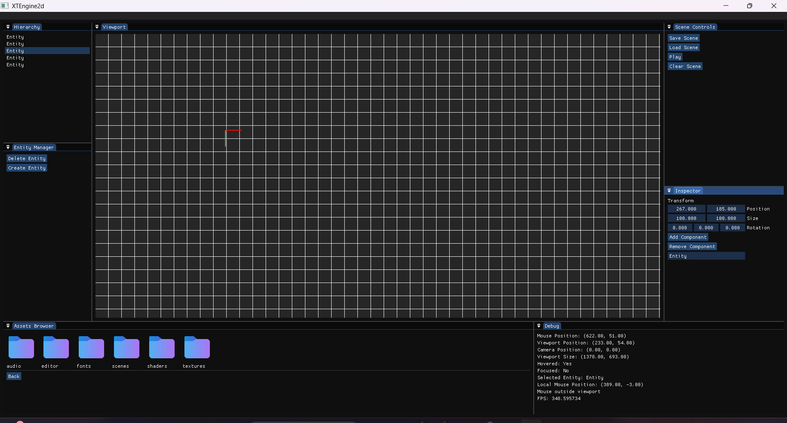
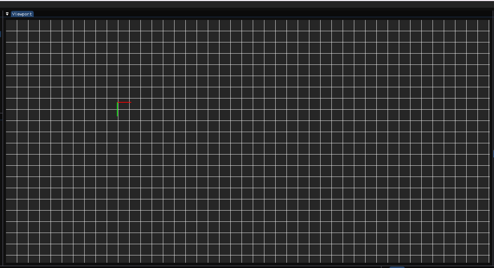
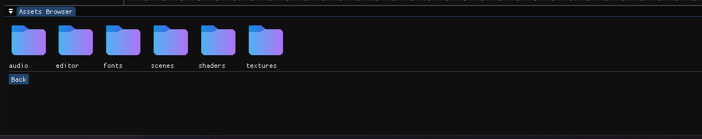

# XTEngine2D

> A custom 2D game engine and editor built in **C++**, **OpenGL**, and **ImGui**.

---

## Features

### Engine
- Entity Component System (ECS)
- Orthographic camera system
- Texture loading and caching
- Framebuffer rendering
- Scene serialization/deserialization
- Runtime and editor mode separation

### Editor
- Docking UI using ImGui
- Scene hierarchy
- Inspector panel
- Asset browser
- Viewport rendering
- Entity picking
- Gizmos
- Grid rendering
- Zoom and camera movement
- Drag and drop asset workflow

---

## Tech Stack

- C++
- OpenGL
- GLFW
- GLM
- ImGui
- stb_image
- JSON

---

## Screenshots

### Editor


### Viewport


### Asset Browser


---

## Project Structure

```txt
XTEngine2d/
│
├── Engine/        # Core engine code
├── Sandbox/       # Testing project
├── Assets/        # Assets used in development
├── Vendor/        # Third-party libraries
└── README.md
```

---

## Current Progress

### Implemented
- ECS registry
- Rendering system
- Texture system
- Asset manager
- Scene system
- Editor camera
- Viewport panel
- Entity inspector
- Scene saving/loading
- Asset browser
- Drag and drop asset loading

### In Progress
- Runtime/play mode workflow
- Physics system
- Animation system
- Prefab system
- Audio system

---

## Goals

- Build a complete custom 2D game engine
- Learn engine architecture
- Create a usable level editor
- Add scripting support in the future

---

## Build Instructions

```bash
git clone <repo-url>
```

Open the Visual Studio solution and build the project.

---

## Notes

This engine is currently under active development.

Some assets used during development are not included in the repository due to licensing restrictions.

---

## License

Apache License